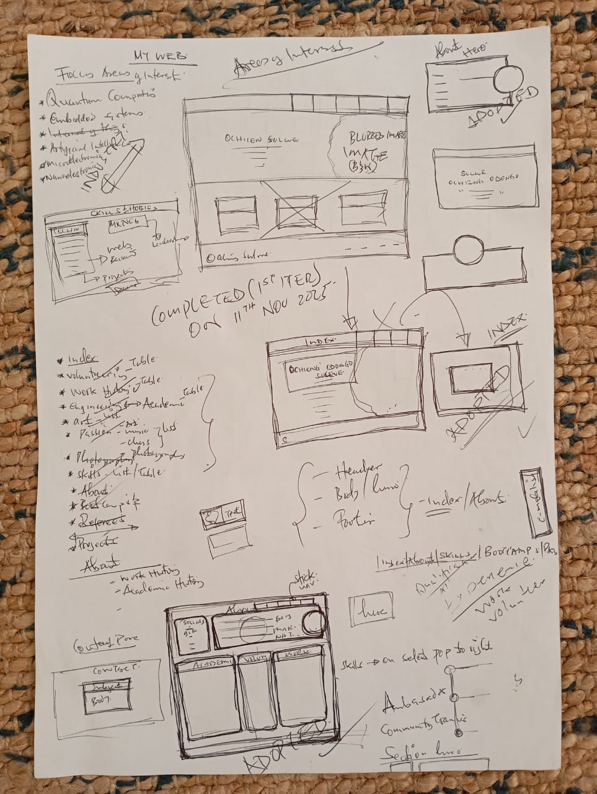
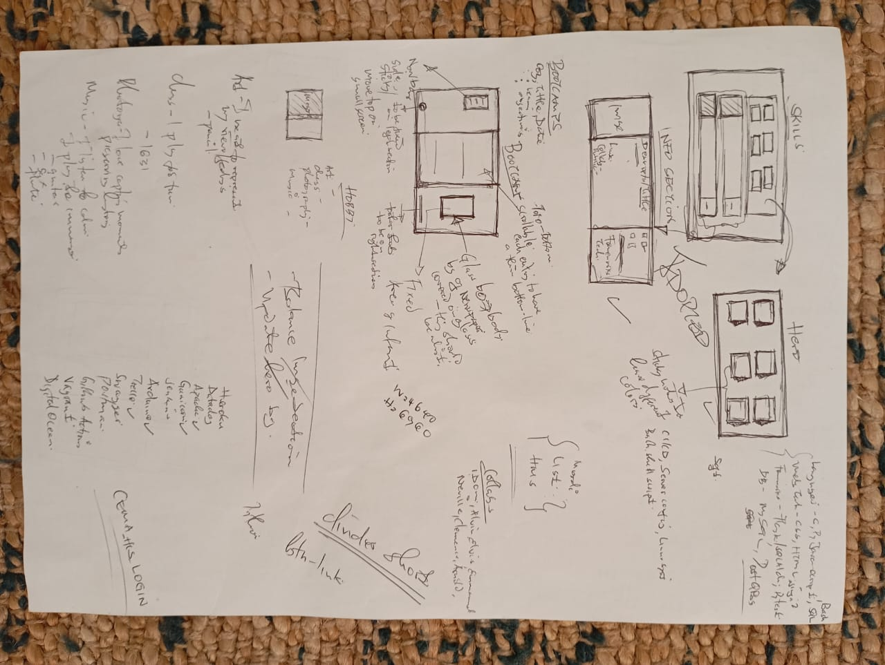

# 🪞 whoami — Personal Portfolio of Ochieng’ Sulwe

**whoami** is a personal portfolio website that blends elegance with minimalism to showcase my technical and creative journey.  
It serves as both a professional presentation and an experimental playground where design meets engineering.

---

## 🌐 Live Preview
**[Visit Portfolio →](https://sulwe.vercel.app/)**

---

## 🧭 Overview

The **whoami** website introduces my work, philosophy, and technical experience across different domains —  
from **embedded systems and microprocessor technology** to **software design**, **healthcare innovation**, and **team leadership**.

Each page is uniquely crafted for clarity, harmony, and responsiveness.

---

## 🧩 Structure

| Section | Description |
|----------|--------------|
| **Home** | Landing page introducing my identity and tagline: “I build systems. I inspire teams. I play ideas into harmony.” |
| **About** | Professional background and personal story presented with a clean hero layout. |
| **Portfolio** | Split into tech stacks and complete projects. Includes a grid of “sticky note” elements showcasing my stacks and a list of my complete projects. |
| **Contact** | A water-glass–styled section allowing visitors to reach out via email and connect professionally. |

---

## 🧠 Tech Stack

- **HTML5**  
- **CSS3** (Flexbox + Grid + Responsive design)  
- **JavaScript** (light interactivity)  
- **SVG Icons** and **minimal animations**
---

## 🖌️ Design Principles

- **Glassmorphism** with subtle blur and shadow effects  
- **Soft gold and grey color palette** for elegance  
- **Typography:** IBM Plex Mono for technical precision  
- **Fully responsive** — adapts seamlessly from widescreen to mobile view  
- **Accessibility-first** — clean contrast, clear structure, semantic HTML  

---

## 🎨 Design Inspiration

This portfolio draws inspiration from the timeless charm of **books** — compact, dark-toned covers that hold deep meaning within.  
Books have always been a big part of my life, so I mirrored their structure and mood in my design.

---

### 📖 The General Concept
The overall design embraces **dark and minimalistic tones**, reflecting both the mystery and depth of a closed book.  
The **landing page** and **closing (contact) page** are intentionally dark, representing the front and back covers of a book — the beginning and end of a story.

---

### 🛏️ The Landing Page
The landing page features a background photo of my bed — on it lie my favorite play, *The Government Inspector* by **Nikolai Gogol**, a **watch**, and a **Yale cap**.  
Together, they symbolize my immersion in reading and learning, while staying mindful of balance — between time, rest, and curiosity.

---

### 💡 Academic, Volunteer, and Industry Panels
When exploring **ACADEMIC HISTORY**, **VOLUNTEER WORK**, or **INDUSTRY EXPERIENCE**, the viewer encounters **dark panels** inspired by book blurbs — those sections on book covers that summarize and illuminate the story within.  
On hover, each section **glows**, illustrating how deeper understanding brings light — the “illumination” of knowledge and context.

---

### 🧩 Portfolio Page
The **Portfolio page** features colorful **sticky notes** that resemble quick, sentimental reminders.  
They are deliberately playful — shifting slightly on hover — to evoke a sense of joy, warmth, and curiosity.  
While my technical side builds the structure, these little details reflect my **sentimental and creative side** — joyful, thoughtful, and full of wonder.

---

### 📬 The Contact Page
The **Contact page** serves as the quiet closing of a book.  
It omits the top navigation bar, maintaining simplicity — just like how the back cover of a book is often minimalist.  
Its dark shade is **slightly lighter** than the landing page, symbolizing both completion and continuation.

---

### ⚙️ Design Values
This entire portfolio stands on three creative pillars:

- **Professionalism** — through structured design and clean transitions.  
- **Playfulness** — through interactive elements and vivid highlights.  
- **Joyfulness** — through color, detail, and warmth that invite exploration.

---

### ✏️ Sketches and Early Concepts
The design was carefully planned through hand-drawn sketches — exploring page structure, color contrast, and emotional flow.  
You can view the concept sketches below to see how each page came to life:

   
  <em>Landing, About, and Contact Page Sketches — conceptualizing the book-inspired entry for the
  landing and the thought process of settling for the best layout.</em>

   
  <em>Portfolio Page Sketch — early vision of the sticky note design and the projects
  panels.</em>

---
## 🙏 Acknowledgments

I’d like to express my gratitude to everyone who inspired, guided, and supported the development of **whoami** — my personal portfolio website.

---
## 👥 Contributors

| Name | Role | Contribution |
|------|------|---------------|
| [Ochieng' Sulwe](https://github.com/ochiengsulwe) | Creator & Developer | Design, Development, Content |
| [Arnold Oduma](https://github.com/ArnoldOduma) | Reviewer | UI Review, Feedback |
| [Hassan Mogeni](https://www.linkedin.com/in/hassan-mogeni-b83261312/) | Reviewer | UI Review, Feedback |
| [Elijah Kipsang](https://www.linkedin.com/in/elijahkipsang/) | Reviewer | UI Review, Feedback |
| [Dorah Mboya](https://www.) | Reviewer | UI Review, Feedback |

---
